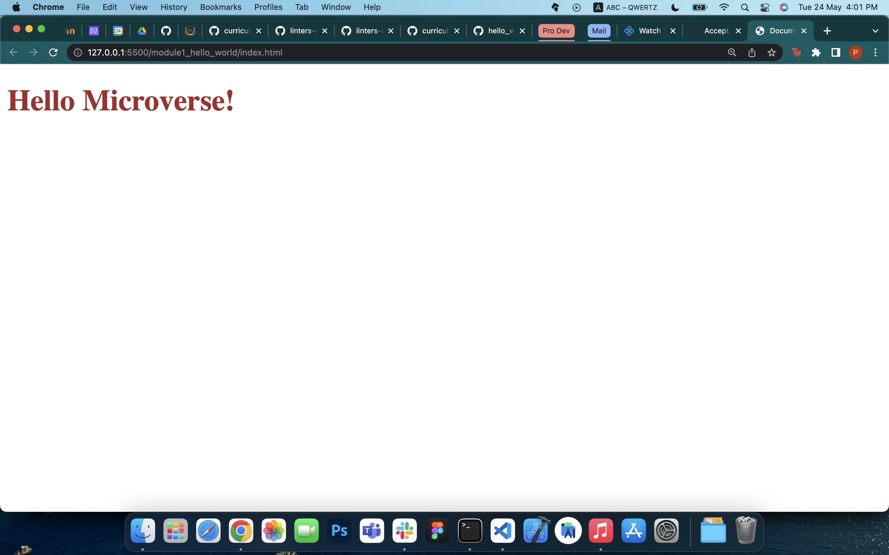

# Hello World

> Learning best practices of GitHub flow.

Hello Microverse

## Built With

- HTML & CSS

## Getting Started

To get a local copy up and running follow these simple example steps.

### Prerequisites

A Web Browser (preferably Google Chrome)

### Setup

Clone the GitHub Repository

### Usage

Open index.html in Chrome

## Authors

👤 **Author1**

- GitHub: [@peterdtitan](https://github.com/peterdtitan)
- Twitter: [@PeterDeTitan](https://twitter.com/PeterDeTitan)
- LinkedIn: [Peter Okorafor](https://www.linkedin.com/in/peterokorafor)

## 🤝 Contributing

Contributions, issues, and feature requests are welcome!

Feel free to check the [issues page](../../issues/).

## Show your support

Give a ⭐️ if you like this project!

## Acknowledgments

- Microverse